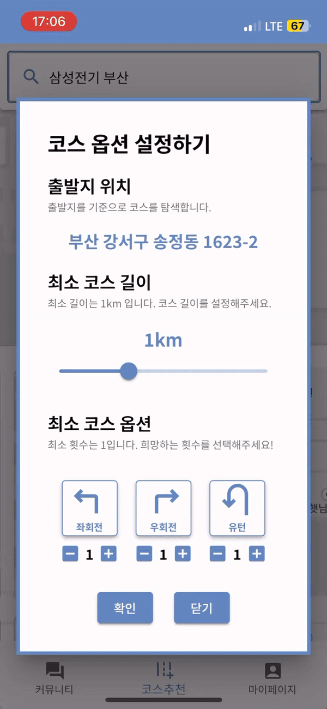
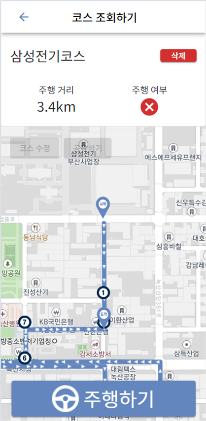

# 도로로

## 서비스 소개

**운전 연습을 하고 싶은데, 어떻게 해야할 지 모르겠을 때? 도로로와 함께 해보세요!**  
빈 주차장에서 연습하자니 실력이 안 느는 것 같고…  
운전 연습하기 좋은 코스를 검색해보니… 너무 멀리 나가야하네? 갔다가 어느 세월에 돌아오지?  
이런 고민을 하고 있다면,  
도로로와 함께 내 주변에서 운전 연습하기 좋은 코스를 찾아봐요!

> 개발 기간  
2024.02.20 - 2024.04.04

## 서비스 화면
<tr style="width : 100%">
    <td align="center"> 로딩 페이지</td>
</tr>
<tr style="width : 100%">
    <td align="center"> 출발지 설정</td>
    <td align="center"> 코스 옵션 설정</td>
    <td align="center"> 코스 추천 결과</td>
    <td align="center"> 코스 선택 및 저장</td>
  </tr>
* 로딩 페이지  
 

* 코스 추천   
  * 출발지 설정  
    
  * 코스 옵션 설정   
    
  * 코스 추천 결과  
    
  * 코스 선택 및 저장  
    

* 코스 주행  
  * 코스 조회  
    
  * 코스 주행  
     
* 코스 커스텀  
  

## 주요 기능
* 코스 추천 기능 : 운전 연습에 적합한 코스를 판별하고 추천해주는 기능
  * 사용자가 설정한 옵션이 포함된 코스가 최대 5개 추천됩니다.  
  * 옵션은 좌회전/우회전/유턴 횟수를 설정할 수 있습니다.  
  * 출발점은 사용자의 현재 위치를 받아오거나, 직접 검색하여 설정할 수 있습니다.   
* 코스 주행 기능 : 추천 받은 코스를 직접 주행하고 실시간으로 확인하는 기능  
  * 사용자 위치 기반으로 올바르게 주행하는지 실시간으로 확인할 수 있습니다.
  * 완주 여부가 저장됩니다.  
* 코스 커스텀 기능 : 주행 완료한 코스를 사용자가 원하는 대로 수정하는 기능

## 기술 스택
### Back

  
   

  

### Front
  
   

  

### Infra  
  
  
 

### Communication  
 
 
 

## 아키텍쳐

## 팀원 소개

<table>
  <tr style="width : 100%">
    <td align="center"> 손종민</td>
    <td align="center"> 김민</td>
    <td align="center"> 김영후</td>
    <td align="center"> 문지호</td>
    <td align="center"> 위동민</td>
    <td align="center"> 진성민</td>
  </tr>
</table>
